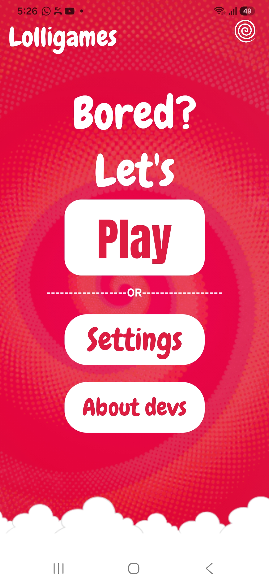

# Lolligames
Lolligames is a cross-platform product that offers games for physical parties of any number of members.
_____________
1. Android app using Android Studio:
The homescreen consists of a play button, settings, and details about the developers. The play button leads to the play menu, where the user chooses between viewing the entire game catalog or to play a tournament. Games themselves haven't been added to the app yet, but the core format of the app is ready. The app currently has a dice roller, which will be used for games added later on. The app is made by Kotlin & Jetpack Compose. 

